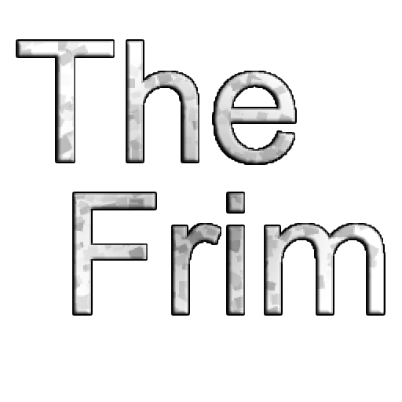

A Story focused 3D-Voxel (minecraft clone) game completely written from *scratch**.

> Trailer

(put video here)

https://github.com/Kade-github/TheFrim/assets/26305836/b84e82ee-5f13-4347-93b4-19b6217b0533

# Description

The Frim is a 3D Voxel Survival Game that takes place on ‘The Frim,’ a planet on the edge of the galaxy, far away from all that is known. You arrive on the planet by unknown means. With no means of escape, you are forced to venture into the planet, trying to piece together what this place is. Is it truely uninhabited? Were there people here? You’ll find all the answers on The Frim.

## Fight for survival!

Build shelters, find food to regain health, and fight off the monsters that might threaten you!

Craft and create weapons and tools to help your exploration of The Frim.

## Explore The Frim

Explore the caves and ruins that litter The Frim. Try to find new recipes to craft, and materials to upgrade your arsenal.

Find a way to escape The Frim and reach back to society!

# Building

The game can be build with **Cmake**, the main CMakeLists.txt is in the `src/` directory.

The project is **cross-compatible** with Linux and Windows; I personally used clang-16 on std::C++20

```bash
cmake -B build
cmake --build build
# Then copy the `Assets` folder into the `build` folder.
cp ../Assets build/Assets -r
```

# Binaries

Linux and Windows binaries can be found on the [releases tab](https://github.com/Kade-github/TheFrim/tags), though if you want bleeding edge you'll find builds per-commit on the [actions tab](https://github.com/Kade-github/TheFrim/actions/workflows/build.yml).

# Libraries and Attributions

This game is under the [MIT License](https://github.com/Kade-github/TheFrim/blob/main/LICENSE). 

[The OpenGL Spec](https://www.opengl.org/)

[GLFW](https://www.glfw.org/)

[MSGPack](https://msgpack.org/index.html)

[MSGPack-c](https://github.com/msgpack/msgpack-c)

[Glad](https://github.com/Dav1dde/glad)

[Assimp](https://github.com/assimp/assimp)

[BS::Thread_Pool](https://github.com/bshoshany/thread-pool)

The Bass Audio Library is used under an individual that doesn't make money from this project, thus the individual doesn't require a commercial license. (as stated on the un4seen website, located below)

[BASS Audio Library](https://www.un4seen.com/)
